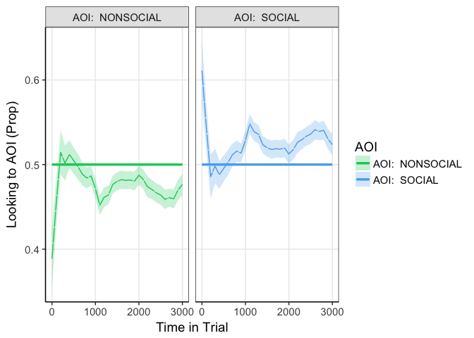
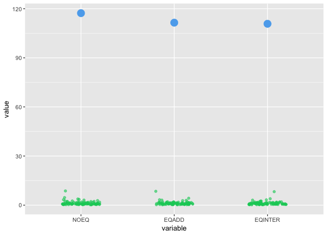

# Index

| Section | Description | Status |
| --- | --- | --- |
| [Data preparation](#prep) | Preparing the data | **Complete** |
| [Window Analysis](#windowan) | Standard AOI analysis (no time dimension) | **Complete** |
| [Growth Curve Analysis](#growthcurve) | Model change in gaze bias over time | **Complete** |
| [Individual differences](#indiff) | Look at relationship between individual characteristics and gaze bias | **Complete** |
| [Cross validation](#crossval) | Final model that fits individual differences | Incomplete |

***

<a id='prep'></a>
# Load and prepare the data.

```r
load('Wspacenew.RData')
head(BIGDATA_CLEAN)
```

```
##    XL YL XR YR SUBIND Timestamp Trial               AOI1         AOI2
## 11 NA NA NA NA      8    274979     1 cake8borderLum.jpg wedding2.jpg
## 12 NA NA NA NA      8    291648     1 cake8borderLum.jpg wedding2.jpg
## 13 NA NA NA NA      8    308317     1 cake8borderLum.jpg wedding2.jpg
## 14 NA NA NA NA      8    324676     1 cake8borderLum.jpg wedding2.jpg
## 15 NA NA NA NA      8    341345     1 cake8borderLum.jpg wedding2.jpg
## 16 NA NA NA NA      8    358014     1 cake8borderLum.jpg wedding2.jpg
##    AOIstim AOI sc  ps track isinAOI SOCIAL NONSOCIAL items time
## 11       -   -    106  TRUE       0  FALSE     FALSE    24   17
## 12       -   -    106  TRUE       0  FALSE     FALSE    24   34
## 13       -   -    106  TRUE       0  FALSE     FALSE    24   51
## 14       -   -    106  TRUE       0  FALSE     FALSE    24   68
## 15       -   -    106  TRUE       0  FALSE     FALSE    24   85
## 16       -   -    106  TRUE       0  FALSE     FALSE    24  102
```

Here I assign the a variable for whether the image is inact or scrambled and also the subject EQ/AQ data.


```r
library(stringr)
BIGDATA_CLEAN$sc2=ifelse((str_detect(as.character(BIGDATA_CLEAN$AOI1), "scrambled")),2,1)
BIGDATA_CLEAN$sc2=factor(BIGDATA_CLEAN$sc2,levels=c(1,2),labels=c('Intact','Scrambled'))


SUBCHARS=read.csv("ppAQEQ.csv")

BIGDATA_CLEAN$EQ=rep(0,nrow(BIGDATA_CLEAN))
BIGDATA_CLEAN$AQ=rep(0,nrow(BIGDATA_CLEAN))


for (p in 1:length(filevec)){
  BIGDATA_CLEAN[BIGDATA_CLEAN$ps==subs[p],]$EQ=rep(SUBCHARS[SUBCHARS$PP==subs[p],]$Emp_Quot)
  BIGDATA_CLEAN[BIGDATA_CLEAN$ps==subs[p],]$AQ=rep(SUBCHARS[SUBCHARS$PP==subs[p],]$Aut_Quot)
}
```

The data are ready to be put into eyetrackingR format. The AOIs have been defined (SOCIAL and NONSOCIAL are logicals), there is also a logical trackloss column, a participant identifier (ps) an item identifier (Trial) and a time column (time).

Now put the data into eyetrackingR format.


```r
library(eyetrackingR)
data <- make_eyetrackingr_data(BIGDATA_CLEAN, 
                               participant_column = "ps",
                               trial_column = "Trial",
                               time_column = "time",
                               aoi_columns = c("SOCIAL","NONSOCIAL"),
                               treat_non_aoi_looks_as_missing = TRUE,trackloss_column="track")
```

```
## `mutate_each()` is deprecated.
## Use `mutate_all()`, `mutate_at()` or `mutate_if()` instead.
## To map `funs` over a selection of variables, use `mutate_at()`
```

Plot some example data

```r
library(ggplot2)
INTPLOTX2=ggplot(data[data$ps==1 & data$sc2=='Intact',],aes(x=time,y=XL))+geom_vline(aes(xintercept=time,colour=track),alpha=.1)+geom_point(size=1,colour="springgreen3")+facet_wrap(~Trial,ncol=7)+theme(panel.grid.minor = element_blank(),panel.background = element_blank(), axis.line = element_line(colour = "black"))+ theme(strip.background = element_rect(fill="gray90"))+scale_colour_manual(values=c("white","pink"))
INTPLOTX2
```

```
## Warning: Removed 1801 rows containing missing values (geom_point).
```

<!-- -->


***

<a id='windowan'></a>

## Window analysis_plot

```r
library(ggplot2)
response_window_agg_by_sub <- make_time_window_data(data, aois=c("SOCIAL","NONSOCIAL"),summarize_by = "ps",predictor_columns = c("sc2","EQ"))
```

```
## Analyzing SOCIAL...
```

```
## Analyzing NONSOCIAL...
```

```r
P1=ggplot(response_window_agg_by_sub,aes(x=AOI,y=Prop))+facet_grid(.~sc2)+  stat_summary(fun.y=mean,position=position_dodge(width=0.95),geom="bar",aes(fill=AOI),size=2,alpha=.5,colour="black")+theme_bw(base_size = 14)+ylab("Gaze Proportion")+geom_point(colour="red",position = position_jitter(w=0.2),alpha=.5,size=1)+
  theme(panel.grid.minor = element_blank(),panel.background = element_blank(), axis.line = element_line(colour = "black"))+ theme(strip.background = element_rect(fill="gray90"))+scale_colour_discrete(guide=FALSE)+ theme(axis.text.x = element_text(angle = 25, hjust = 1))+ scale_fill_manual(values = c("springgreen3","steelblue2"))+theme(legend.position = "none")+ggtitle("a)")
P1
```

<!-- -->

## Window analysis_model

```r
library(lme4)
```

```
## Loading required package: Matrix
```

```r
library(afex)
```

```
## Loading required package: lsmeans
```

```
## The 'lsmeans' package is being deprecated.
## Users are encouraged to switch to 'emmeans'.
## See help('transition') for more information, including how
## to convert 'lsmeans' objects and scripts to work with 'emmeans'.
```

```
## ************
## Welcome to afex. For support visit: http://afex.singmann.science/
```

```
## - Functions for ANOVAs: aov_car(), aov_ez(), and aov_4()
## - Methods for calculating p-values with mixed(): 'KR', 'S', 'LRT', and 'PB'
## - 'afex_aov' and 'mixed' objects can be passed to lsmeans() for follow-up tests
## - Get and set global package options with: afex_options()
## - Set orthogonal sum-to-zero contrasts globally: set_sum_contrasts()
## - For example analyses see: browseVignettes("afex")
## ************
```

```
## 
## Attaching package: 'afex'
```

```
## The following object is masked from 'package:lme4':
## 
##     lmer
```

```r
library(phia)
```

```
## Loading required package: car
```

```
## Warning: package 'car' was built under R version 3.4.3
```

```r
library(nlme)
```

```
## 
## Attaching package: 'nlme'
```

```
## The following object is masked from 'package:lme4':
## 
##     lmList
```

```r
library(effects)
```

```
## Loading required package: carData
```

```
## 
## Attaching package: 'carData'
```

```
## The following objects are masked from 'package:car':
## 
##     Guyer, UN, Vocab
```

```
## lattice theme set by effectsTheme()
## See ?effectsTheme for details.
```

```r
# Set up model

response_window_agg_by_sub$AOI=factor(response_window_agg_by_sub$AOI)
model_window <- lmer(Prop ~ AOI*sc2 + (1 | ps), data = response_window_agg_by_sub, REML = FALSE)

model_window_p = mixed(Prop ~ AOI*sc2+(1|ps), response_window_agg_by_sub)
```

```
## Contrasts set to contr.sum for the following variables: AOI, sc2, ps
```

```
## Fitting one lmer() model. [DONE]
## Calculating p-values. [DONE]
```

```r
# Get p values
model_window_p
```

```
## Mixed Model Anova Table (Type 3 tests, KR-method)
## 
## Model: Prop ~ AOI * sc2 + (1 | ps)
## Data: response_window_agg_by_sub
##    Effect     df          F p.value
## 1     AOI 1, 294 117.76 ***  <.0001
## 2     sc2 1, 294       0.00    >.99
## 3 AOI:sc2 1, 294  19.18 ***  <.0001
## ---
## Signif. codes:  0 '***' 0.001 '**' 0.01 '*' 0.05 '+' 0.1 ' ' 1
```

```r
# Test interactions
testInteractions(model_window, fixed=c("sc2"), pairwise=c("AOI"),adjustment="holm")
```

```
## Chisq Test: 
## P-value adjustment method: holm
##                                 Value Df   Chisq Pr(>Chisq)    
## NONSOCIAL-SOCIAL :    Intact -0.11633  1 117.183  < 2.2e-16 ***
## NONSOCIAL-SOCIAL : Scrambled -0.04943  1  21.158   4.23e-06 ***
## ---
## Signif. codes:  0 '***' 0.001 '**' 0.01 '*' 0.05 '.' 0.1 ' ' 1
```

There are main effects of AOI and an interaction between AOI and scramb. The effect of AOI is greater in the intact condition.


Now plot the relationship between EQ, gaze prop and stimtype.

```r
response_window_agg_by_sub$AOI=factor(response_window_agg_by_sub$AOI)
model_windowEQ <- lmer(Prop ~ AOI*sc2*EQ + (1 | ps), data = response_window_agg_by_sub, REML = FALSE)

testInteractions(model_windowEQ, fixed=c("EQ"), pairwise=c("AOI","sc2"),adjustment="holm")
```

```
## Warning in testInteractions(model_windowEQ, fixed = c("EQ"), pairwise =
## c("AOI", : Some factors with specified contrasts are not in the model and
## will be ignored.
```

```
## Chisq Test: 
## P-value adjustment method: holm
##                                         Value Df  Chisq Pr(>Chisq)    
## NONSOCIAL-SOCIAL : Intact-Scrambled -0.068818  1 22.753  1.842e-06 ***
## ---
## Signif. codes:  0 '***' 0.001 '**' 0.01 '*' 0.05 '.' 0.1 ' ' 1
```

```r
eff=allEffects(model_windowEQ)
effframe=data.frame(eff$`AOI:sc2:EQ`)


P3=ggplot(effframe,(aes(x=EQ,y=fit)))+geom_line(aes(colour=AOI),size=2)+facet_grid(.~sc2)+geom_errorbar(aes(ymin=lower,ymax=upper,colour=AOI),size=2)+ scale_colour_manual(values = c("springgreen3","steelblue2"))+ scale_fill_manual(values = c("springgreen3","steelblue2"))+theme_bw(base_size=14)+
  theme(panel.grid.minor = element_blank(),panel.background = element_blank(), axis.line = element_line(colour = "black"))+ theme(strip.background = element_rect(fill="gray90"))+ylab("Gaze Proportion")+theme(legend.position = "top")+ggtitle("b)")

P3
```

<!-- -->

3 way interaction between EQ, stimulus type and AOI.

***
<a id='growthcurve'></a>

## Growth Curve analysis_plot


```r
response_time <- make_time_sequence_data(data, time_bin_size = 100,aois = c("NONSOCIAL","SOCIAL"),summarize_by = "ps",predictor_columns = c("sc2"))
```

```
## Analyzing NONSOCIAL...
```

```
## Analyzing SOCIAL...
```

```r
P2=plot(response_time, predictor_column = "AOI")+ scale_colour_manual(values = c("springgreen3","steelblue2","springgreen3","steelblue2"))+ scale_fill_manual(values = c("springgreen3","steelblue2","springgreen3","steelblue2"))+theme_bw(base_size=14)+
  theme(panel.grid.minor = element_blank(),panel.background = element_blank(), axis.line = element_line(colour = "black"))+ theme(strip.background = element_rect(fill="gray90"))+facet_grid(.~sc2)+ theme(legend.position="top")+ggtitle("c)")


multiplot(P1,P2,P3,layout=matrix(c(1,3,2,2), nrow=2, byrow=TRUE))
```

```
## Warning: Removed 192 rows containing non-finite values (stat_summary).

## Warning: Removed 192 rows containing non-finite values (stat_summary).
```

<!-- -->

## Growth Curve analysis_model

Since we are dealing with mutliple interactions with multiple higher-order polynomials, I think it is justified to fit a model independently to scrambled and intact stimuli, to help with interpretation.

### Intact

Model 1- Start with nothing (intercept only)


```r
model_time_sequence_intact0 <- lmer(Prop ~ 1+(1|ps),data = response_time[response_time$sc2=="Intact",], REML = FALSE)
plot(response_time[response_time$sc2=="Intact",], predictor_column = c("AOI"), dv = "Prop", model = model_time_sequence_intact0)+ scale_colour_manual(values = c("springgreen3","steelblue2","springgreen3","steelblue2"))+ scale_fill_manual(values = c("springgreen3","steelblue2","springgreen3","steelblue2"))+theme_bw(base_size=14)+
  theme(panel.grid.minor = element_blank(),panel.background = element_blank(), axis.line = element_line(colour = "black"))+ theme(strip.background = element_rect(fill="gray90"))
```

```
## Warning: Removed 96 rows containing non-finite values (stat_summary).

## Warning: Removed 96 rows containing non-finite values (stat_summary).
```

<!-- -->


Model 2 - Just AOI as a fixed effect


```r
model_time_sequence_intact1 <- lmer(Prop ~ AOI+(1|ps),data = response_time[response_time$sc2=="Intact",], REML = FALSE)
plot(response_time[response_time$sc2=="Intact",], predictor_column = c("AOI"), dv = "Prop", model = model_time_sequence_intact1)+ scale_colour_manual(values = c("springgreen3","steelblue2","springgreen3","steelblue2"))+ scale_fill_manual(values = c("springgreen3","steelblue2","springgreen3","steelblue2"))+theme_bw(base_size=14)+
  theme(panel.grid.minor = element_blank(),panel.background = element_blank(), axis.line = element_line(colour = "black"))+ theme(strip.background = element_rect(fill="gray90"))
```

```
## Warning: Removed 96 rows containing non-finite values (stat_summary).

## Warning: Removed 96 rows containing non-finite values (stat_summary).
```

<!-- -->

```r
anova(model_time_sequence_intact1,model_time_sequence_intact0)
```

```
## Data: response_time[response_time$sc2 == "Intact", ]
## Models:
## model_time_sequence_intact0: Prop ~ 1 + (1 | ps)
## model_time_sequence_intact1: Prop ~ AOI + (1 | ps)
##                             Df     AIC     BIC logLik deviance  Chisq
## model_time_sequence_intact0  3 -5178.7 -5158.6 2592.4  -5184.7       
## model_time_sequence_intact1  4 -6137.1 -6110.3 3072.6  -6145.1 960.38
##                             Chi Df Pr(>Chisq)    
## model_time_sequence_intact0                      
## model_time_sequence_intact1      1  < 2.2e-16 ***
## ---
## Signif. codes:  0 '***' 0.001 '**' 0.01 '*' 0.05 '.' 0.1 ' ' 1
```

We continue. 

Model 3 - Include linear term.


```r
model_time_sequence_intact2 <- lmer(Prop ~ AOI*(ot1)+(1 + ot1 |ps),data = response_time[response_time$sc2=="Intact",], REML = FALSE)

plot(response_time[response_time$sc2=="Intact",], predictor_column = c("AOI"), dv = "Prop", model = model_time_sequence_intact2)+ scale_colour_manual(values = c("springgreen3","steelblue2","springgreen3","steelblue2"))+ scale_fill_manual(values = c("springgreen3","steelblue2","springgreen3","steelblue2"))+theme_bw(base_size=14)+
  theme(panel.grid.minor = element_blank(),panel.background = element_blank(), axis.line = element_line(colour = "black"))+ theme(strip.background = element_rect(fill="gray90"))
```

```
## Warning: Removed 96 rows containing non-finite values (stat_summary).

## Warning: Removed 96 rows containing non-finite values (stat_summary).
```

<!-- -->

```r
anova(model_time_sequence_intact2,model_time_sequence_intact1)
```

```
## Data: response_time[response_time$sc2 == "Intact", ]
## Models:
## model_time_sequence_intact1: Prop ~ AOI + (1 | ps)
## model_time_sequence_intact2: Prop ~ AOI * (ot1) + (1 + ot1 | ps)
##                             Df     AIC     BIC logLik deviance  Chisq
## model_time_sequence_intact1  4 -6137.1 -6110.3 3072.6  -6145.1       
## model_time_sequence_intact2  8 -6189.8 -6136.1 3102.9  -6205.8 60.665
##                             Chi Df Pr(>Chisq)    
## model_time_sequence_intact1                      
## model_time_sequence_intact2      4  2.103e-12 ***
## ---
## Signif. codes:  0 '***' 0.001 '**' 0.01 '*' 0.05 '.' 0.1 ' ' 1
```

We continue.

Model 4 - Include linear and quadratic term.


```r
model_time_sequence_intact3 <- lmer(Prop ~ AOI*(ot1+ot2)+(1 + ot1 + ot2 |ps),data = response_time[response_time$sc2=="Intact",], REML = FALSE)

plot(response_time[response_time$sc2=="Intact",], predictor_column = c("AOI"), dv = "Prop", model = model_time_sequence_intact3)+ scale_colour_manual(values = c("springgreen3","steelblue2","springgreen3","steelblue2"))+ scale_fill_manual(values = c("springgreen3","steelblue2","springgreen3","steelblue2"))+theme_bw(base_size=14)+
  theme(panel.grid.minor = element_blank(),panel.background = element_blank(), axis.line = element_line(colour = "black"))+ theme(strip.background = element_rect(fill="gray90"))
```

```
## Warning: Removed 96 rows containing non-finite values (stat_summary).

## Warning: Removed 96 rows containing non-finite values (stat_summary).
```

<!-- -->

```r
anova(model_time_sequence_intact2,model_time_sequence_intact3)
```

```
## Data: response_time[response_time$sc2 == "Intact", ]
## Models:
## model_time_sequence_intact2: Prop ~ AOI * (ot1) + (1 + ot1 | ps)
## model_time_sequence_intact3: Prop ~ AOI * (ot1 + ot2) + (1 + ot1 + ot2 | ps)
##                             Df     AIC     BIC logLik deviance  Chisq
## model_time_sequence_intact2  8 -6189.8 -6136.1 3102.9  -6205.8       
## model_time_sequence_intact3 13 -6218.6 -6131.4 3122.3  -6244.6 38.797
##                             Chi Df Pr(>Chisq)    
## model_time_sequence_intact2                      
## model_time_sequence_intact3      5  2.609e-07 ***
## ---
## Signif. codes:  0 '***' 0.001 '**' 0.01 '*' 0.05 '.' 0.1 ' ' 1
```

We continue.

Model 5 - Include linear, quadratic and cubic term.


```r
# Linear + quadratic + cubic
model_time_sequence_intact4 <- lmer(Prop ~ AOI*(ot1+ot2+ot3)+(1+ ot1 + ot2 + ot3 |ps),data = response_time[response_time$sc2=="Intact",], REML = FALSE)

plot(response_time[response_time$sc2=="Intact",], predictor_column = c("AOI"), dv = "Prop", model = model_time_sequence_intact4)+ scale_colour_manual(values = c("springgreen3","steelblue2","springgreen3","steelblue2"))+ scale_fill_manual(values = c("springgreen3","steelblue2","springgreen3","steelblue2"))+theme_bw(base_size=14)+
  theme(panel.grid.minor = element_blank(),panel.background = element_blank(), axis.line = element_line(colour = "black"))+ theme(strip.background = element_rect(fill="gray90"))
```

```
## Warning: Removed 96 rows containing non-finite values (stat_summary).

## Warning: Removed 96 rows containing non-finite values (stat_summary).
```

<!-- -->

```r
anova(model_time_sequence_intact4,model_time_sequence_intact3)
```

```
## Data: response_time[response_time$sc2 == "Intact", ]
## Models:
## model_time_sequence_intact3: Prop ~ AOI * (ot1 + ot2) + (1 + ot1 + ot2 | ps)
## model_time_sequence_intact4: Prop ~ AOI * (ot1 + ot2 + ot3) + (1 + ot1 + ot2 + ot3 | ps)
##                             Df     AIC     BIC logLik deviance  Chisq
## model_time_sequence_intact3 13 -6218.6 -6131.4 3122.3  -6244.6       
## model_time_sequence_intact4 19 -6220.5 -6093.1 3129.3  -6258.5 13.994
##                             Chi Df Pr(>Chisq)  
## model_time_sequence_intact3                    
## model_time_sequence_intact4      6     0.0297 *
## ---
## Signif. codes:  0 '***' 0.001 '**' 0.01 '*' 0.05 '.' 0.1 ' ' 1
```

Here is a good place to stop for now. We plan to additionally model the effect of EQ later on, so we run the risk of over-fitting.


### Scrambled

Model 1- Start with nothing (intercept only)


```r
model_time_sequence_scramb0 <- lmer(Prop ~ 1+(1|ps),data = response_time[response_time$sc2=="Scrambled",], REML = FALSE)
plot(response_time[response_time$sc2=="Scrambled",], predictor_column = c("AOI"), dv = "Prop", model = model_time_sequence_scramb0)+ scale_colour_manual(values = c("springgreen3","steelblue2","springgreen3","steelblue2"))+ scale_fill_manual(values = c("springgreen3","steelblue2","springgreen3","steelblue2"))+theme_bw(base_size=14)+
  theme(panel.grid.minor = element_blank(),panel.background = element_blank(), axis.line = element_line(colour = "black"))+ theme(strip.background = element_rect(fill="gray90"))
```

```
## Warning: Removed 96 rows containing non-finite values (stat_summary).

## Warning: Removed 96 rows containing non-finite values (stat_summary).
```

<!-- -->

Model 2- Add AOI


```r
model_time_sequence_scramb1 <- lmer(Prop ~ AOI+(1|ps),data = response_time[response_time$sc2=="Scrambled",], REML = FALSE)
plot(response_time[response_time$sc2=="Scrambled",], predictor_column = c("AOI"), dv = "Prop", model = model_time_sequence_scramb1)+ scale_colour_manual(values = c("springgreen3","steelblue2","springgreen3","steelblue2"))+ scale_fill_manual(values = c("springgreen3","steelblue2","springgreen3","steelblue2"))+theme_bw(base_size=14)+
  theme(panel.grid.minor = element_blank(),panel.background = element_blank(), axis.line = element_line(colour = "black"))+ theme(strip.background = element_rect(fill="gray90"))
```

```
## Warning: Removed 96 rows containing non-finite values (stat_summary).

## Warning: Removed 96 rows containing non-finite values (stat_summary).
```

<!-- -->

```r
anova(model_time_sequence_scramb1,model_time_sequence_scramb0)
```

```
## Data: response_time[response_time$sc2 == "Scrambled", ]
## Models:
## model_time_sequence_scramb0: Prop ~ 1 + (1 | ps)
## model_time_sequence_scramb1: Prop ~ AOI + (1 | ps)
##                             Df     AIC     BIC logLik deviance  Chisq
## model_time_sequence_scramb0  3 -6255.5 -6235.4 3130.8  -6261.5       
## model_time_sequence_scramb1  4 -6419.1 -6392.2 3213.5  -6427.1 165.53
##                             Chi Df Pr(>Chisq)    
## model_time_sequence_scramb0                      
## model_time_sequence_scramb1      1  < 2.2e-16 ***
## ---
## Signif. codes:  0 '***' 0.001 '**' 0.01 '*' 0.05 '.' 0.1 ' ' 1
```


Model 3- Add Linear term.


```r
model_time_sequence_scramb2 <- lmer(Prop ~ AOI*(ot1)+(1 +ot1| ps),data = response_time[response_time$sc2=="Scrambled",], REML = FALSE)

plot(response_time[response_time$sc2=="Scrambled",], predictor_column = c("AOI"), dv = "Prop", model = model_time_sequence_scramb2)+ scale_colour_manual(values = c("springgreen3","steelblue2","springgreen3","steelblue2"))+ scale_fill_manual(values = c("springgreen3","steelblue2","springgreen3","steelblue2"))+theme_bw(base_size=14)+
  theme(panel.grid.minor = element_blank(),panel.background = element_blank(), axis.line = element_line(colour = "black"))+ theme(strip.background = element_rect(fill="gray90"))
```

```
## Warning: Removed 96 rows containing non-finite values (stat_summary).

## Warning: Removed 96 rows containing non-finite values (stat_summary).
```

<!-- -->

```r
anova(model_time_sequence_scramb1,model_time_sequence_scramb2)
```

```
## Data: response_time[response_time$sc2 == "Scrambled", ]
## Models:
## model_time_sequence_scramb1: Prop ~ AOI + (1 | ps)
## model_time_sequence_scramb2: Prop ~ AOI * (ot1) + (1 + ot1 | ps)
##                             Df     AIC     BIC logLik deviance  Chisq
## model_time_sequence_scramb1  4 -6419.1 -6392.2 3213.5  -6427.1       
## model_time_sequence_scramb2  8 -6418.7 -6365.1 3217.4  -6434.7 7.6695
##                             Chi Df Pr(>Chisq)
## model_time_sequence_scramb1                  
## model_time_sequence_scramb2      4     0.1045
```

Linear does not improve on the model. This is a very complex and noisy function. I feel that we would need to fit a number of higher-order functions to model the growth and ultimately we would just be fitting to noise. The evidence would seem to point to the bias being pretty time-invariant.


***

<a id='indiff'></a>
# Individual differences

## Visualise individual data (intact).

```r
response_time_mod_in=cbind(response_time[response_time$sc2=="Intact" & !is.na(response_time$Prop),],predict(model_time_sequence_intact4))

colnames(response_time_mod_in)=c(colnames(response_time),"pred")

ggplot(response_time_mod_in[response_time_mod_in$sc2=="Intact",],aes(x=TimeBin,y=Prop))+facet_wrap(~ps,nrow=8)+geom_line(aes(x=TimeBin,y=pred,colour=AOI),size=2,linetype="solid")+geom_point(aes(colour=AOI),size=0.5,shape=6)+ scale_colour_manual(values = c("springgreen3","steelblue2","springgreen3","steelblue2"))+ scale_fill_manual(values = c("springgreen3","steelblue2","springgreen3","steelblue2"))+theme_bw(base_size=14)+
  theme(panel.grid.minor = element_blank(),panel.background = element_blank(), axis.line = element_line(colour = "black"))+ theme(strip.background = element_rect(fill="gray90"))
```

<!-- -->

## Visualise individual data (scrambled).


```r
response_time_mod_in=cbind(response_time[response_time$sc2=="Scrambled" & !is.na(response_time$Prop),],predict(model_time_sequence_scramb1))

colnames(response_time_mod_in)=c(colnames(response_time),"pred")

ggplot(response_time_mod_in[response_time_mod_in$sc2=="Scrambled",],aes(x=TimeBin,y=Prop))+facet_wrap(~ps,nrow=8)+geom_line(aes(x=TimeBin,y=pred,colour=AOI),size=2,linetype="solid")+geom_point(aes(colour=AOI),size=0.5,shape=6)+ scale_colour_manual(values = c("springgreen3","steelblue2","springgreen3","steelblue2"))+ scale_fill_manual(values = c("springgreen3","steelblue2","springgreen3","steelblue2"))+theme_bw(base_size=14)+
  theme(panel.grid.minor = element_blank(),panel.background = element_blank(), axis.line = element_line(colour = "black"))+ theme(strip.background = element_rect(fill="gray90"))
```

<!-- -->

A lot of unmodeled variation at the individual level. Now check for the effect of EQ within each time bin.


```r
num_sub = length(unique((data$ps)))-1
threshold_t = qt(p = 1 - .05/2, df = num_sub-1)

response_time_new <- make_time_sequence_data(data, time_bin_size = 100,aois = c("SOCIAL"),predictor_columns = c("sc2","AQ","EQ"),summarize_by="ps")

df_timeclust_between <- make_time_cluster_data(response_time_new[response_time_new$sc2=="Intact",], test= "lm",predictor_column = "EQ", threshold = threshold_t)

Px=plot(df_timeclust_between)

clust_analysis_between <- analyze_time_clusters(df_timeclust_between, within_subj = FALSE, samples=1000)
```

```
## Install package 'pbapply' for a progress bar in this function.
```

```r
Py=plot(clust_analysis_between)
multiplot(Px,Py)
```

<!-- -->


Plot the modeled effect of empathy.


```r
library(pracma)
```

```
## Warning: package 'pracma' was built under R version 3.4.3
```

```
## 
## Attaching package: 'pracma'
```

```
## The following object is masked from 'package:car':
## 
##     logit
```

```
## The following objects are masked from 'package:Matrix':
## 
##     expm, lu, tril, triu
```

```r
EQvec=linspace(min(na.omit(data$EQ)),max(na.omit(data$EQ)),10)


temp=response_time[response_time$ps==1,]
tempin=temp[temp$sc2=="Intact",]

# Assign 10 levels of EQ (min-max)
VARFRAME=data.frame()
for (EQi in 1:length(EQvec)){
  TEMPFRAME=tempin
  TEMPFRAME$EQ=rep(EQvec[EQi])
  VARFRAME=rbind(TEMPFRAME,VARFRAME)
}


# Make the model predictions
VARFRAME2=cbind(VARFRAME,predict(model_time_sequence_EQ,VARFRAME))

# Plot the predictions.  
colnames(VARFRAME2)=c(colnames(VARFRAME),"pred")
VARFRAME2$EQ=factor(VARFRAME2$EQ)

ggplot(VARFRAME2,aes(x=TimeBin,y=Prop))+facet_grid(.~EQ)+geom_line(aes(x=TimeBin,y=pred,colour=AOI),size=2,linetype="solid")+ scale_colour_manual(values = c("springgreen3","steelblue2"))
```

<!-- -->


```r
response_time_new2 <- make_time_sequence_data(data, time_bin_size = 100,aois = c("SOCIAL","NONSOCIAL"),predictor_columns = c("sc2","AQ","EQ"),summarize_by="ps")
```

```
## Analyzing SOCIAL...
```

```
## Analyzing NONSOCIAL...
```

```r
EQFRAME=response_time_new2[response_time_new2$sc2=="Intact" & !is.na(response_time_new2$EQ),]


model_EQquad=lmer(Prop ~ EQ * AOI * (ot1 + ot2) + (1 + ot1 + ot2 | ps),data = EQFRAME, REML = FALSE)


mod3=cbind(EQFRAME[EQFRAME$sc2=="Intact" & !is.na(EQFRAME$Prop),],predict(model_EQquad))

colnames(mod3)=c(colnames(EQFRAME),"pred")

ggplot(mod3[mod3$sc2=="Intact",],aes(x=TimeBin,y=Prop))+facet_wrap(~ps,nrow=8)+geom_line(aes(x=TimeBin,y=pred,colour=AOI),size=2,linetype="solid")+geom_point(aes(colour=AOI),size=0.5,shape=6)+ scale_colour_manual(values = c("springgreen3","steelblue2","springgreen3","steelblue2"))
```

<!-- -->


***


# Tested models

1) Null
2) AOI
3) EQ * AOI
4) EQ * AOI * lin
5) EQ * AOI * quad
6) EQ * AOI * lin + quad
7) EQ * AOI * cub
8) EQ * AOI * lin + cub
9) EQ * AOI * quad + cub
10) EQ * AOI * lin + quad + cub 


```r
# m1=lmer(Prop ~ 1 + (1 | ps),data = EQFRAME, REML = FALSE)
# m2=lmer(Prop ~ AOI + (1 | ps),data = EQFRAME, REML = FALSE)
# m3=lmer(Prop ~ EQ*AOI + (1 | ps),data = EQFRAME, REML = FALSE)
# m4=lmer(Prop ~ EQ * AOI * (ot1) + (1 + ot1  | ps),data = EQFRAME, REML = FALSE)
# m5=lmer(Prop ~ EQ * AOI * (ot2) + (1 + ot2 | ps),data = EQFRAME, REML = FALSE)
# m6=lmer(Prop ~ EQ * AOI * (ot1 + ot2) + (1 + ot1 + ot2 | ps),data = EQFRAME, REML = FALSE)
# m7=lmer(Prop ~ EQ * AOI * (ot3) + (1 + ot3 | ps),data = EQFRAME, REML = FALSE)
# m8=lmer(Prop ~ EQ * AOI * (ot1 + ot3) + (1 + ot1 + ot3 | ps),data = EQFRAME, REML = FALSE)
# m9=lmer(Prop ~ EQ * AOI * (ot2 + ot3) + (1 + ot2 + ot3 | ps),data = EQFRAME, REML = FALSE)
# m10=lmer(Prop ~ EQ * AOI * (ot1 + ot2 + ot3) + (1 + ot1 + ot2 + ot3 | ps),data = EQFRAME, REML = FALSE)
# 
# 
# 
# x=new.env()
# createLOOstruct=function(frame){
#   
#   mnames=c("Null","AOI","EQAOI","EQAOIlin","EQAOIquad","EQAOIlinquad","EQAOIcub","EQAOIlincub","EQAOIquadcub","EQAOIlinquadcub")
#   mcalls=c(m1@call$formula,m2@call$formula,m3@call$formula,m4@call$formula,m5@call$formula,m6@call$formula,m7@call$formula,m8@call$formula,m9@call$formula,m10@call$formula)
# 
#   psvec=as.numeric(levels(frame$ps))
#   
#   # Define names to assign to in the new environment.
#   envsin=strcat("In",as.character(levels(frame$ps)),"env")
#   envsout=strcat("Out",as.character(levels(frame$ps)),"env")
#   actual=strcat("Actual",as.character(levels(frame$ps)),"env")
#   
#    for (i in 1:length(mnames)){
#     assign(strcat("fit",mnames[i]),strcat(mnames[i],as.character(levels(frame$ps))),envir=x)
#     assign(strcat("predfit",mnames[i]),strcat(mnames[i],as.character(levels(frame$ps))),envir=x)
#     assign(strcat("error",mnames[i]),strcat(mnames[i],as.character(levels(frame$ps))),envir=x)
# }
# 
#   
#   # For each participant
#   for (i in 1:length(psvec)){
#     # Create a frame that includes everyone but the one subject ('kept in' frame).
#     assign(envsin[i],frame[frame$ps!=psvec[i],],envir=x)
#     # Create a frame that includes just the one subject ('left out' frame)
#     assign(envsout[i],frame[frame$ps==psvec[i] & !is.na(frame$Prop),],envir=x)
#     
#   }
#   return(x)
# }
#   
# 
# LOOSTRUCT=createLOOstruct(EQFRAME)
# 
# 
# envsin=strcat("In",as.character(levels(frame$ps)),"env")
# envsout=strcat("Out",as.character(levels(frame$ps)),"env")
# actual=strcat("Actual",as.character(levels(frame$ps)),"env")
# assign(strcat("predfit",mnames[i]),strcat(mnames[i],as.character(levels(frame$ps))))
# 
# 
# 
# psvec=as.numeric(levels(frame$ps))
#   for (i in 1:length(psvec)){
#      assign(actual[i],get(envsout[i],envir=x)$Prop, envir = x)
#     for (m in 1:length(mnames)){
#       print(c(i,m))
#       assign(strcat("fit",mnames[m],as.character(psvec[i])),lmer(formula=mcalls[[m]],data = get(envsin[i],envir=x), REML = FALSE), envir = x)
#     }
#   }
# 
# 
# 
#   #for (i in 1:length(psvec)){
#     #for (m in 1:length(mnames)){
#   
# 
# for (i in 1:15){
#     for (m in 1:length(mnames)){
# 
#       #print(c(i,m))
#       temp_model=get(strcat("fit",mnames[m],as.character(psvec[i])),envir=x)
#       print(temp_model)
#       temp_env=get(envsout[i],envir=x)
#       temp_actual=get(actual[i],envir=x)
#       assign(strcat("predfit",mnames[m],as.character(psvec[i])),predict(temp_model,temp_env,allow.new.levels=TRUE),envir=x)
#         }
#   }
# 
# 
# for (i in 1:15){
#     for (m in 1:length(mnames)){
# 
#       assign(strcat("plot",mnames[m],as.character(psvec[i])),qplot(get(strcat("predfit",mnames[m],as.character(psvec[i])),envir=x),get(actual[i],envir=x)),envir=x)
#     }
# }
# 
# 
# 
# 
#       
#       
#     
#     # Get the actual values for the left-out subject.
#     
#     
#     # Original model
#     # Using the model fits, get the predictions for the 'left out' data and compute the sum of squares.
#     assign(predfit1[i],predict(get(fit1[i],envir = x),get(envsout[i],envir=x),allow.new.levels = TRUE), envir = x)
#     assign(error[i],sum((get(actual[i],envir=x) - get(predfit1[i],envir=x)) ^2), envir = x)
#     
#     
#     # +EQ model
#     assign(predfitEQ[i],predict(get(fitEQ[i],envir = x),get(envsout[i],envir=x),allow.new.levels = TRUE), envir = x)
#     assign(errorEQ[i],sum((get(actual[i],envir=x) - get(predfitEQ[i],envir=x)) ^2), envir = x)
#     
#     # +EQ + GE model
#     assign(predfitEQGE[i],predict(get(fitEQGE[i],envir = x),get(envsout[i],envir=x),allow.new.levels = TRUE), envir = x)
#     assign(errorEQGE[i],sum((get(actual[i],envir=x) - get(predfitEQGE[i],envir=x)) ^2), envir = x)
#     
#     # Just GE model
#     assign(predfitGE[i],predict(get(fitGE[i],envir = x),get(envsout[i],envir=x),allow.new.levels = TRUE), envir = x)
#     assign(errorGE[i],sum((get(actual[i],envir=x) - get(predfitGE[i],envir=x)) ^2), envir = x)
#     
#     # Just AOI model
#     assign(predfitAOI[i],predict(get(fitAOI[i],envir = x),get(envsout[i],envir=x),allow.new.levels = TRUE), envir = x)
#     assign(errorAOI[i],sum((get(actual[i],envir=x) - get(predfitAOI[i],envir=x)) ^2), envir = x)
#     
#     # Just AOI and linear
#     assign(predfitAOIlin[i],predict(get(fitAOIlin[i],envir = x),get(envsout[i],envir=x),allow.new.levels = TRUE), envir = x)
#     assign(errorAOIlin[i],sum((get(actual[i],envir=x) - get(predfitAOIlin[i],envir=x)) ^2), envir = x)
#     
#   }
#   return(x)
# }
# 
# LOOSTRUCT=createLOOstruct(EQFRAME)
```


