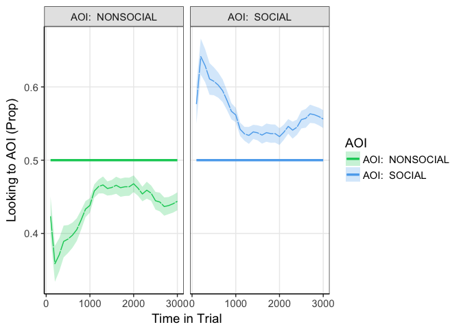

# Index

| Section | Description | Status |
| --- | --- | --- |
| [Data preparation](#prep) | Preparing the data | **Complete** |
| [Window Analysis](#windowan) | Standard AOI analysis (no time dimension) | **Complete** |
| [Growth Curve Analysis](#growthcurve) | Model change in gaze bias over time | **Complete** |
| [Leave one out analysis 1](#LOO1) | Determine the best model of the global time-series | **Complete** |
| [Individual differences](#indiff) | Look at relationship between EQ and gaze bias | **Complete** |
| [Leave one out analysis 2](#LOO2) | Determine the best model of the time-series (models with EQ) | **Complete** |

***

<a id='prep'></a>
# Load and prepare the data.

```r
setwd("/Users/nicholashedger/Google\ Drive/haffeybits")
load('Wspacenew.RData')
head(BIGDATA_CLEAN)
```

```
##    XL YL XR YR SUBIND Timestamp Trial               AOI1         AOI2
## 11 NA NA NA NA      8    274979     1 cake8borderLum.jpg wedding2.jpg
## 12 NA NA NA NA      8    291648     1 cake8borderLum.jpg wedding2.jpg
## 13 NA NA NA NA      8    308317     1 cake8borderLum.jpg wedding2.jpg
## 14 NA NA NA NA      8    324676     1 cake8borderLum.jpg wedding2.jpg
## 15 NA NA NA NA      8    341345     1 cake8borderLum.jpg wedding2.jpg
## 16 NA NA NA NA      8    358014     1 cake8borderLum.jpg wedding2.jpg
##    AOIstim AOI sc  ps track isinAOI SOCIAL NONSOCIAL items time
## 11       -   -    106  TRUE       0  FALSE     FALSE    24   17
## 12       -   -    106  TRUE       0  FALSE     FALSE    24   34
## 13       -   -    106  TRUE       0  FALSE     FALSE    24   51
## 14       -   -    106  TRUE       0  FALSE     FALSE    24   68
## 15       -   -    106  TRUE       0  FALSE     FALSE    24   85
## 16       -   -    106  TRUE       0  FALSE     FALSE    24  102
```

Here I assign the a variable for whether the image is inact or scrambled and also add the subject EQ/AQ data.


```r
library(stringr)
BIGDATA_CLEAN$sc2=ifelse((str_detect(as.character(BIGDATA_CLEAN$AOI1), "scrambled")),2,1)
BIGDATA_CLEAN$sc2=factor(BIGDATA_CLEAN$sc2,levels=c(1,2),labels=c('Intact','Scrambled'))


SUBCHARS=read.csv("ppAQEQ.csv")

BIGDATA_CLEAN$EQ=rep(0,nrow(BIGDATA_CLEAN))
BIGDATA_CLEAN$AQ=rep(0,nrow(BIGDATA_CLEAN))


for (p in 1:length(filevec)){
  BIGDATA_CLEAN[BIGDATA_CLEAN$ps==subs[p],]$EQ=rep(SUBCHARS[SUBCHARS$PP==subs[p],]$Emp_Quot)
  BIGDATA_CLEAN[BIGDATA_CLEAN$ps==subs[p],]$AQ=rep(SUBCHARS[SUBCHARS$PP==subs[p],]$Aut_Quot)
}
```

The data are ready to be put into eyetrackingR format. The AOIs have been defined (SOCIAL and NONSOCIAL are logicals), there is also a logical trackloss column, a participant identifier (ps) an item identifier (Trial) and a time column (time).

Now put the data into eyetrackingR format.


```r
library(eyetrackingR)
data <- make_eyetrackingr_data(BIGDATA_CLEAN, 
                               participant_column = "ps",
                               trial_column = "Trial",
                               time_column = "time",
                               aoi_columns = c("SOCIAL","NONSOCIAL"),
                               treat_non_aoi_looks_as_missing = TRUE,trackloss_column="track")
```

```
## `mutate_each()` is deprecated.
## Use `mutate_all()`, `mutate_at()` or `mutate_if()` instead.
## To map `funs` over a selection of variables, use `mutate_at()`
```

***

<a id='windowan'></a>

## Window analysis_plot

Here I collapse time across the entire trial length and return a dataframe for plotting/ analyis.


```r
library(ggplot2)
response_window_agg_by_sub <- make_time_window_data(data, aois=c("SOCIAL","NONSOCIAL"),summarize_by = "ps",predictor_columns = c("sc2","EQ"))
```

```
## Analyzing SOCIAL...
```

```
## Analyzing NONSOCIAL...
```

```r
P1=ggplot(response_window_agg_by_sub,aes(x=AOI,y=Prop))+facet_grid(.~sc2)+  stat_summary(fun.y=mean,position=position_dodge(width=0.95),geom="bar",aes(fill=AOI),size=2,alpha=.5,colour="black")+theme_bw(base_size = 11)+ylab("Gaze Proportion")+geom_point(colour="red",position = position_jitter(w=0.2),alpha=.5,size=1)+
  theme(panel.grid.minor = element_blank(),panel.grid.major = element_blank(),panel.background = element_blank(), axis.line = element_line(colour = "black"))+ theme(strip.background = element_rect(fill="gray90"))+scale_colour_discrete(guide=FALSE)+ theme(axis.text.x = element_text(angle = 25, hjust = 1))+ scale_fill_manual(values = c("springgreen3","steelblue2"))+theme(legend.position = "none")+ggtitle("a)")
P1
```

<!-- -->

## Window analysis_model

Now I fit a model to the window data. Perform tests of model coefficients via likelihood ratio tests. 

```r
library(lme4)
library(afex)
library(phia)
```

```
## Warning: package 'car' was built under R version 3.4.3
```

```r
library(nlme)
library(effects)

# Set up model
response_window_agg_by_sub$AOI=factor(response_window_agg_by_sub$AOI)
model_window <- lmer(Prop ~ AOI*sc2 + (1 | ps), data = response_window_agg_by_sub, REML = FALSE)

model_window_p = mixed(Prop ~ AOI*sc2+(1|ps), response_window_agg_by_sub,method="LRT")
```

```
## Fitting 4 (g)lmer() models:
## [....]
```

```r
# Get p values
model_window_p
```

```
## Mixed Model Anova Table (Type 3 tests, LRT-method)
## 
## Model: Prop ~ AOI * sc2 + (1 | ps)
## Data: response_window_agg_by_sub
## Df full model: 6
##    Effect df      Chisq p.value
## 1     AOI  1 104.02 ***  <.0001
## 2     sc2  1       0.00    >.99
## 3 AOI:sc2  1  18.92 ***  <.0001
## ---
## Signif. codes:  0 '***' 0.001 '**' 0.01 '*' 0.05 '+' 0.1 ' ' 1
```

```r
# Get the coefficients for the intact and scrambled conditions
testInteractions(model_window, fixed=c("sc2"), pairwise=c("AOI"),adjustment="holm")
```

```
## Chisq Test: 
## P-value adjustment method: holm
##                                 Value Df   Chisq Pr(>Chisq)    
## NONSOCIAL-SOCIAL :    Intact -0.11633  1 117.183  < 2.2e-16 ***
## NONSOCIAL-SOCIAL : Scrambled -0.04943  1  21.158   4.23e-06 ***
## ---
## Signif. codes:  0 '***' 0.001 '**' 0.01 '*' 0.05 '.' 0.1 ' ' 1
```

There are main effects of AOI and an interaction between AOI and scramb. The effect of AOI is greater in the intact condition.

Now plot the relationship between EQ, gaze prop and stimtype.


```r
response_window_agg_by_sub$AOI=factor(response_window_agg_by_sub$AOI)
model_windowEQ <- lmer(Prop ~ AOI*sc2*EQ + (1 | ps), data = response_window_agg_by_sub, REML = FALSE)

model_windowEQp <- mixed(Prop ~ AOI*sc2*EQ+(1|ps), response_window_agg_by_sub,method="LRT")
```

```
## Warning in mixed(Prop ~ AOI * sc2 * EQ + (1 | ps),
## response_window_agg_by_sub, : Due to missing values, reduced number of
## observations to 392
```

```
## Warning in mixed(Prop ~ AOI * sc2 * EQ + (1 | ps),
## response_window_agg_by_sub, : Due to missing values, set_data_arg set to
## FALSE.
```

```
## Fitting 8 (g)lmer() models:
## [
```

```
## Warning: contrasts dropped from factor ps due to missing levels
```

```
## Warning: contrasts dropped from factor ps due to missing levels
```

```
## .
```

```
## Warning: contrasts dropped from factor ps due to missing levels

## Warning: contrasts dropped from factor ps due to missing levels
```

```
## .
```

```
## Warning: contrasts dropped from factor ps due to missing levels

## Warning: contrasts dropped from factor ps due to missing levels
```

```
## .
```

```
## Warning: contrasts dropped from factor ps due to missing levels

## Warning: contrasts dropped from factor ps due to missing levels
```

```
## .
```

```
## Warning: contrasts dropped from factor ps due to missing levels

## Warning: contrasts dropped from factor ps due to missing levels
```

```
## .
```

```
## Warning: contrasts dropped from factor ps due to missing levels

## Warning: contrasts dropped from factor ps due to missing levels
```

```
## .
```

```
## Warning: contrasts dropped from factor ps due to missing levels

## Warning: contrasts dropped from factor ps due to missing levels
```

```
## .
```

```
## Warning: contrasts dropped from factor ps due to missing levels

## Warning: contrasts dropped from factor ps due to missing levels
```

```
## .]
```

```r
model_windowEQp
```

```
## Mixed Model Anova Table (Type 3 tests, LRT-method)
## 
## Model: Prop ~ AOI * sc2 * EQ + (1 | ps)
## Data: response_window_agg_by_sub
## Df full model: 10
##       Effect df     Chisq p.value
## 1        AOI  1   8.21 **    .004
## 2        sc2  1      0.00    >.99
## 3         EQ  1      0.00    >.99
## 4    AOI:sc2  1      1.42     .23
## 5     AOI:EQ  1 32.29 ***  <.0001
## 6     sc2:EQ  1      0.00    >.99
## 7 AOI:sc2:EQ  1    5.90 *     .02
## ---
## Signif. codes:  0 '***' 0.001 '**' 0.01 '*' 0.05 '+' 0.1 ' ' 1
```

```r
eff=allEffects(model_windowEQ)
effframe=data.frame(eff$`AOI:sc2:EQ`)


P3=ggplot(effframe,(aes(x=EQ,y=fit)))+geom_line(aes(colour=AOI),size=2)+facet_grid(.~sc2)+geom_errorbar(aes(ymin=lower,ymax=upper,colour=AOI),size=2)+ scale_colour_manual(values = c("springgreen3","steelblue2"))+ scale_fill_manual(values = c("springgreen3","steelblue2"))+theme_bw(base_size=11)+
  theme(panel.grid.minor = element_blank(),panel.grid.major = element_blank(),panel.background = element_blank(), axis.line = element_line(colour = "black"))+ theme(strip.background = element_rect(fill="gray90"))+ylab("Gaze Proportion")+theme(legend.position = "top")+ggtitle("b)")

P3
```

<!-- -->

3 way interaction between EQ, stimulus type and AOI.

***
<a id='growthcurve'></a>

## Growth Curve analysis_plot


Here, instead of collapsing across time I summarise proportion of looking within each time bin.


```r
# First of all remove any trials where the trackloss is greater than 60%
bef=nrow(data)
data <- clean_by_trackloss(data = data, trial_prop_thresh = .60)
```

```
## Performing Trackloss Analysis...
```

```
## Will exclude trials whose trackloss proportion is greater than : 0.6
```

```
## 	...removed  1292  trials.
```

```r
af=nrow(data)


(bef-af)/bef*100
```

```
## [1] 15.85918
```

```r
# 16% of the data is removed.

response_time <- make_time_sequence_data(data, time_bin_size = 100,aois = c("NONSOCIAL","SOCIAL"),summarize_by = "ps",predictor_columns = c("sc2"))
```

```
## Analyzing NONSOCIAL...
```

```
## Analyzing SOCIAL...
```

```r
# Also get rid of the first 100ms timebin due to the lack of valid samples.
tapply(response_time$SamplesTotal,response_time$Time,mean)
```

```
##          0        100        200        300        400        500 
##   9.666667  31.717172  63.525253  96.979798 121.853535 141.292929 
##        600        700        800        900       1000       1100 
## 151.641414 157.681818 134.934343 165.676768 169.035354 171.212121 
##       1200       1300       1400       1500       1600       1700 
## 172.747475 173.964646 174.297980 174.717172 146.116162 175.595960 
##       1800       1900       2000       2100       2200       2300 
## 175.888889 176.126263 175.500000 174.611111 173.737374 172.808081 
##       2400       2500       2600       2700       2800       2900 
## 173.313131 144.883838 174.398990 174.247475 172.858586 171.944444 
##       3000 
##  76.136364
```

```r
response_time =response_time[response_time$Time>=100,]

# Remove the first time bin
P2=plot(response_time[response_time$sc2=="Intact",], predictor_column = "AOI")+ scale_colour_manual(values = c("springgreen3","steelblue2","springgreen3","steelblue2"))+ scale_fill_manual(values = c("springgreen3","steelblue2","springgreen3","steelblue2"))+theme_bw(base_size=11)+
  theme(panel.grid.minor = element_blank(),panel.grid.major = element_blank(),panel.background = element_blank(), axis.line = element_line(colour = "black"))+ theme(strip.background = element_rect(fill="gray90"))+facet_grid(.~sc2)+ theme(legend.position="top")+ggtitle("c)")+ylab("Gaze Proportion")


multiplot(P1,P2,P3,layout=matrix(c(1,1,1,3,3,3,0,2,2,2,2,0), nrow=2, byrow=TRUE))
```

```
## Warning: Removed 36 rows containing non-finite values (stat_summary).

## Warning: Removed 36 rows containing non-finite values (stat_summary).
```

<!-- -->

## Growth Curve analysis_model

Since we are dealing with mutliple interactions with multiple higher-order polynomials, I think it is justified to fit a model independently to scrambled and intact stimuli, to help with interpretation.

### Intact

Model 1- Start a model with the intercept only. This means that there is no bias towards either AOI. Plot the predictions to help interpretation.


```r
model_time_sequence_intact0 <- lmer(Prop ~ 1+(1|ps),data = response_time[response_time$sc2=="Intact",], REML = FALSE)
plot(response_time[response_time$sc2=="Intact",], predictor_column = c("AOI"), dv = "Prop", model = model_time_sequence_intact0)+ scale_colour_manual(values = c("springgreen3","steelblue2","springgreen3","steelblue2"))+ scale_fill_manual(values = c("springgreen3","steelblue2","springgreen3","steelblue2"))+theme_bw(base_size=14)+
  theme(panel.grid.minor = element_blank(),panel.background = element_blank(), axis.line = element_line(colour = "black"))+ theme(strip.background = element_rect(fill="gray90"))
```

<!-- -->


Model 2 - Now add AOI as a fixed effect. This allows for a vertical offset in gaze proportion dependent on the AOI, but one that is time invariant (a straight line). Plot the predictions


```r
model_time_sequence_intact1 <- lmer(Prop ~ AOI+(1|ps),data = response_time[response_time$sc2=="Intact",], REML = FALSE)

NOTIME=plot(response_time[response_time$sc2=="Intact" & response_time$AOI=="SOCIAL",], predictor_column = c("AOI"), dv = "Prop", model = model_time_sequence_intact1)+ scale_colour_manual(values = c("steelblue2","steelblue2","steelblue2","steelblue2"))+ scale_fill_manual(values = c("steelblue2","steelblue2","steelblue2","steelblue2"))+theme_bw(base_size=11)+
  theme(panel.grid.minor = element_blank(),panel.grid.major = element_blank(),panel.background = element_blank(), axis.line = element_line(colour = "black"))+ theme(strip.background = element_rect(fill="gray90"))+ylab("Gaze Proportion") +xlab("Time in Trial (ms)")+ theme(legend.position="none")
anova(model_time_sequence_intact1,model_time_sequence_intact0)
```

```
## Data: response_time[response_time$sc2 == "Intact", ]
## Models:
## model_time_sequence_intact0: Prop ~ 1 + (1 | ps)
## model_time_sequence_intact1: Prop ~ AOI + (1 | ps)
##                             Df     AIC     BIC logLik deviance  Chisq
## model_time_sequence_intact0  3 -5169.9 -5149.9 2588.0  -5175.9       
## model_time_sequence_intact1  4 -6176.4 -6149.6 3092.2  -6184.4 1008.5
##                             Chi Df Pr(>Chisq)    
## model_time_sequence_intact0                      
## model_time_sequence_intact1      1  < 2.2e-16 ***
## ---
## Signif. codes:  0 '***' 0.001 '**' 0.01 '*' 0.05 '.' 0.1 ' ' 1
```

```r
NOTIME
```

<!-- -->

We continue. 

Model 3 - Include linear term.


```r
model_time_sequence_intact2 <- lmer(Prop ~ AOI*(ot1)+(1 + ot1 |ps),data = response_time[response_time$sc2=="Intact",], REML = FALSE)

LINTIME=plot(response_time[response_time$sc2=="Intact" & response_time$AOI=="SOCIAL" ,], predictor_column = c("AOI"), dv = "Prop", model = model_time_sequence_intact2)+ scale_colour_manual(values = c("steelblue2","steelblue2","steelblue2","steelblue2"))+ scale_fill_manual(values = c("steelblue2","steelblue2","steelblue2","steelblue2"))+theme_bw(base_size=11)+
  theme(panel.grid.minor = element_blank(),panel.grid.major = element_blank(),panel.background = element_blank(), axis.line = element_line(colour = "black"))+ theme(strip.background = element_rect(fill="gray90"))+ylab("Gaze Proportion") +xlab("Time in Trial (ms)")+ theme(legend.position="none")

anova(model_time_sequence_intact2,model_time_sequence_intact1)
```

```
## Data: response_time[response_time$sc2 == "Intact", ]
## Models:
## model_time_sequence_intact1: Prop ~ AOI + (1 | ps)
## model_time_sequence_intact2: Prop ~ AOI * (ot1) + (1 + ot1 | ps)
##                             Df     AIC     BIC logLik deviance  Chisq
## model_time_sequence_intact1  4 -6176.4 -6149.6 3092.2  -6184.4       
## model_time_sequence_intact2  8 -6266.1 -6212.6 3141.0  -6282.1 97.704
##                             Chi Df Pr(>Chisq)    
## model_time_sequence_intact1                      
## model_time_sequence_intact2      4  < 2.2e-16 ***
## ---
## Signif. codes:  0 '***' 0.001 '**' 0.01 '*' 0.05 '.' 0.1 ' ' 1
```

```r
LINTIME
```

<!-- -->

We continue.

Model 4 - Include linear and quadratic term.


```r
model_time_sequence_intact3 <- lmer(Prop ~ AOI*(ot1 + ot2)+(1 + ot1 + ot2 |ps),data = response_time[response_time$sc2=="Intact",], REML = FALSE)

LINQUADTIME=plot(response_time[response_time$sc2=="Intact" & response_time$AOI=="SOCIAL" ,], predictor_column = c("AOI"), dv = "Prop", model = model_time_sequence_intact3)+ scale_colour_manual(values = c("steelblue2","steelblue2","steelblue2","steelblue2"))+ scale_fill_manual(values = c("steelblue2","steelblue2","steelblue2","steelblue2"))+theme_bw(base_size=11)+
  theme(panel.grid.minor = element_blank(),panel.grid.major = element_blank(),panel.background = element_blank(), axis.line = element_line(colour = "black"))+ theme(strip.background = element_rect(fill="gray90"))+ylab("Gaze Proportion") +xlab("Time in Trial (ms)")+ theme(legend.position="none")

LINQUADTIME
```

<!-- -->

```r
anova(model_time_sequence_intact3,model_time_sequence_intact2)
```

```
## Data: response_time[response_time$sc2 == "Intact", ]
## Models:
## model_time_sequence_intact2: Prop ~ AOI * (ot1) + (1 + ot1 | ps)
## model_time_sequence_intact3: Prop ~ AOI * (ot1 + ot2) + (1 + ot1 + ot2 | ps)
##                             Df     AIC     BIC logLik deviance  Chisq
## model_time_sequence_intact2  8 -6266.1 -6212.6 3141.0  -6282.1       
## model_time_sequence_intact3 13 -6365.5 -6278.6 3195.7  -6391.5 109.38
##                             Chi Df Pr(>Chisq)    
## model_time_sequence_intact2                      
## model_time_sequence_intact3      5  < 2.2e-16 ***
## ---
## Signif. codes:  0 '***' 0.001 '**' 0.01 '*' 0.05 '.' 0.1 ' ' 1
```

We continue.

Model 5 - Include linear, quadratic and cubic term.


```r
# Linear + quadratic + cubic
model_time_sequence_intact4 <- lmer(Prop ~ AOI*(ot1 + ot2 + ot3)+(1 + ot1 + ot2 + ot3 |ps),data = response_time[response_time$sc2=="Intact",], REML = FALSE)


anova(model_time_sequence_intact4,model_time_sequence_intact3)
```

```
## Data: response_time[response_time$sc2 == "Intact", ]
## Models:
## model_time_sequence_intact3: Prop ~ AOI * (ot1 + ot2) + (1 + ot1 + ot2 | ps)
## model_time_sequence_intact4: Prop ~ AOI * (ot1 + ot2 + ot3) + (1 + ot1 + ot2 + ot3 | ps)
##                             Df     AIC     BIC logLik deviance  Chisq
## model_time_sequence_intact3 13 -6365.5 -6278.6 3195.7  -6391.5       
## model_time_sequence_intact4 19 -6353.8 -6226.8 3195.9  -6391.8 0.3204
##                             Chi Df Pr(>Chisq)
## model_time_sequence_intact3                  
## model_time_sequence_intact4      6     0.9994
```

Here is a good place to stop for now. The addition of a cubic term doesnt seem to improve on the model. We also plan to model the effect of EQ later on, so we run the risk of over-fitting.

<a id='LOO1'></a>
## Leave one out analysis 1

Perform a leave one out analysis to test the generalisation performance of the models 

First define the model objects.


```r
Intactframe=response_time[response_time$sc2=="Intact",]

m1=lmer(Prop ~ 1 + (1 | ps),data = Intactframe, REML = FALSE)
# AOI only
m2=lmer(Prop ~ AOI + (1 | ps),data = Intactframe, REML = FALSE)
# Aoi and linear 
m3=lmer(Prop ~ AOI * (ot1) + (1 + ot1  | ps),data = Intactframe, REML = FALSE)
# Quadratic
m4=lmer(Prop ~ AOI * (ot2) + (1 + ot2  | ps),data = Intactframe, REML = FALSE)
# Cubic
m5=lmer(Prop ~ AOI * (ot3) + (1 + ot3  | ps),data = Intactframe, REML = FALSE)
# Linear quadratic 
m6=lmer(Prop ~ AOI * (ot1 + ot2) + (1 + ot1 +ot2  | ps),data = Intactframe, REML = FALSE)
# Linear cubic
m7=lmer(Prop ~ AOI * (ot1 + ot3) + (1 + ot1 + ot3  | ps),data = Intactframe, REML = FALSE)
# Quadratic cubic
m8=lmer(Prop ~ AOI * (ot2 + ot3) + (1 + ot2 + ot3  | ps),data = Intactframe, REML = FALSE)
# Linear quadratic/cubic 
m9=lmer(Prop ~ AOI * (ot1 + ot2 + ot3) + (1 + ot1 + ot2 +ot3  | ps),data = Intactframe, REML = FALSE)
```

Now define a function for creating the structures for LOO analysis.


```r
library(pracma)
x=new.env()
createLOOstruct=function(frame){

  # Names of the models.
  mnames=c("Null","AOI","AOIlin","AOIquad","AOIcub","AOIlinquad","AOIlincub","AOIquadcub","AOIlinquadcub","AOIquart")
  
  # Calls for the models.
  mcalls=c(m1@call$formula,m2@call$formula,m3@call$formula,m4@call$formula,m5@call$formula,m6@call$formula,m7@call$formula,m8@call$formula,m9@call$formula)
  
  # Vector for participants
  psvec=as.numeric(levels(frame$ps))

  # Define names to assign to in the new environment.
  
  # The 'kept in' dataframe
  
  envsin=strcat("In",as.character(levels(frame$ps)),"env")
  
  # The 'left out' dataframe
  envsout=strcat("Out",as.character(levels(frame$ps)),"env")
  
  # The actual data (to be compared to the model predictions).
  
  actual=strcat("Actual",as.character(levels(frame$ps)),"env")


  # For each participant
  for (i in 1:length(psvec)){
    # Create a frame that includes everyone but the one subject ('kept in' frame).
    assign(envsin[i],frame[frame$ps!=psvec[i],],envir=x)
    # Create a frame that includes just the one subject ('left out' frame)
    assign(envsout[i],frame[frame$ps==psvec[i] & !is.na(frame$Prop),],envir=x)

  }
  return(x)
}


LOOSTRUCT=createLOOstruct(Intactframe)
```

Fit the model to N-1 observers, test the fit to the left out observer.


```r
envsin=strcat("In",as.character(levels(Intactframe$ps)),"env")
envsout=strcat("Out",as.character(levels(Intactframe$ps)),"env")
actual=strcat("Actual",as.character(levels(Intactframe$ps)),"env")


  mnames=c("Null","AOI","AOIlin","AOIquad","AOIcub","AOIlinquad","AOIlincub","AOIquadcub","AOIlinquadcub")
  # Calls for the models.
  mcalls=c(m1@call$formula,m2@call$formula,m3@call$formula,m4@call$formula,m5@call$formula,m6@call$formula,m7@call$formula,m8@call$formula,m9@call$formula)


# Go through each participant and each model
psvec=as.numeric(levels(Intactframe$ps))
  for (i in 1:length(psvec)){
    # Create variable that represents the left out data for each participant.
     assign(actual[i],get(envsout[i],envir=x)$Prop, envir = x)
    for (m in 1:length(mnames)){
    #  print(c(i,m))
      # Fit the model to the 'kept in' data.
      assign(strcat("fit",mnames[m],as.character(psvec[i])),lmer(formula=mcalls[[m]],data = get(envsin[i],envir=x), REML = TRUE), envir = x)
    }
  }


# Loop through all participants and all models. 
for (i in 1:length(psvec)){
    for (m in 1:length(mnames)){
    #  print(c(i,m))
      # Get the model that was fit to the 'kept in' data (test set)
      temp_model=get(strcat("fit",mnames[m],as.character(psvec[i])),envir=x)
      # Get the left out data
      temp_env=get(envsout[i],envir=x)
      # Get the actual values for the 'left out' data (training set)
      temp_actual=get(actual[i],envir=x)
      # Use the model fit to the test set and use it to predict the data for the test set.
      assign(strcat("predfit",mnames[m],as.character(psvec[i])),predict(temp_model,temp_env,allow.new.levels=TRUE),envir=x)
      temp_predfit=get(strcat("predfit",mnames[m],as.character(psvec[i])),envir=x)
      # Calculate some residuals
      assign(strcat("residual",mnames[m],as.character(psvec[i])),sum((get(actual[i],envir=x) - temp_predfit) ^2),envir=x)}
      
}
```

Now do some plotting of the LOO performance.


```r
mat=matrix(nrow=length(psvec),ncol=length(mnames))

for (i in 1:length(psvec)){
  for (m in 1:length(mnames)){
  mat[i,m]=get(strcat("residual",mnames[m],as.character(psvec[i])),envir=x)

  }
}


matframe=data.frame(mat)
colnames(matframe)=mnames

library(reshape2)

meltframe=melt(matframe)

ggplot(meltframe,(aes(x=variable,y=value)))+geom_point(position=position_jitter(w=0.2),colour="springgreen3",alpha=.6)+stat_summary(fun.y = sum, geom="point",colour="steelblue2",size=5)
```

<!-- -->
We can see that AOI + linear + quadratic has the best LOO performance (lowest sum of residuals). The values are reported in the SI. 

***

<a id='indiff'></a>
# Individual differences


Now try to model variation at the individual level. Check for the effect of EQ within each time bin.


```r
# Calculate t threshold for intial test. 
num_sub = length(unique((data$ps)))
threshold_t = qt(p = 1 - .05/2, df = num_sub-1)

response_time_new <- make_time_sequence_data(data, time_bin_size = 100,aois = c("SOCIAL"),predictor_columns = c("sc2","AQ","EQ"),summarize_by="ps")
response_time_new=response_time_new[response_time_new$Time>=100,]

# Define EQ as a predictor and dind adjacent bins that pass the t test-statistic threshold. 
df_timeclust_between <- make_time_cluster_data(response_time_new[response_time_new$sc2=="Intact",], test= "lm",predictor_column = "EQ", threshold = threshold_t)

# Plot the timebins that exceed the threshold.
Px=plot(df_timeclust_between)+ scale_fill_manual(values = c("springgreen3","steelblue2","springgreen3","steelblue2"))+theme_bw(base_size=11)+
theme(panel.grid.minor = element_blank(),panel.grid.major = element_blank(),panel.background = element_blank(), axis.line = element_line(colour = "black"))+ theme(strip.background = element_rect(fill="gray90"))+xlab("Time in Trial (ms)")


# Perform the bootstrapped-cluster analysis.
clust_analysis_between <- analyze_time_clusters(df_timeclust_between, within_subj = FALSE, samples=1000)
clust_analysis_between
```

```
## Test Type:	 lm 
## Predictor:	 EQ 
## Formula:	 Prop ~ EQ 
## Null Distribution   ====== 
##  Mean:		 -0.1359 
##  2.5%:		 -11.8606 
## 97.5%:		 11.8521 
## Summary of Clusters ======
##   Cluster Direction SumStatistic StartTime EndTime Probability
## 1       1  Positive    25.067448       100     900       0.003
## 2       2  Positive     2.334845      1500    1600       0.315
## 3       3  Positive    29.172195      1800    2900       0.002
```

```r
Py=plot(clust_analysis_between)
multiplot(Px,Py)
```

<!-- -->

```r
#multiplot(P2+ggtitle("a)")+xlab("Time in Trial (ms)"),NOTIME+scale_x_continuous(breaks=linspace(0,3000,2))+ggtitle("b)"),LINTIME+scale_x_continuous(breaks=linspace(0,3000,2))+ggtitle("c)"),LINQUADTIME+scale_x_continuous(breaks=linspace(0,3000,2))+ggtitle("d)"),Px+scale_x_continuous(breaks=linspace(0,3000,2))+ggtitle("d)"),layout=matrix(c(0,1,1,1,1,0,0,1,1,1,1,0,2,2,3,3,4,4), nrow=3, byrow=TRUE))
```


Now add EQ as a fixed effect in addition to the variables defined in our global model. Specify a model that allows EQ to interact with just AOI (reduced interactive) and also one that additionally allows it to interact with time (fully interactive).


```r
response_timeT <- make_time_sequence_data(data, time_bin_size = 100,aois = c("NONSOCIAL","SOCIAL"),summarize_by = "ps",predictor_columns = c("sc2","EQ"))

response_timeT=response_timeT[response_timeT$Time>=100,]
# Remove individuals with no EQ data
EQFRAME=response_timeT[!is.na(response_timeT$EQ),]
EQFRAME$AOI=factor(EQFRAME$AOI)


EQFRAME$ps=factor(EQFRAME$ps)
levels(EQFRAME$ps)=rank(as.numeric(levels(EQFRAME$ps)))

EQFRAME=EQFRAME[EQFRAME$sc2=="Intact",]

# Linear quadratic 
m1=lmer(Prop ~ AOI * (ot1 + ot2) + (1 + ot1 +ot2  | ps),data = EQFRAME, REML = FALSE)
# Linear quadratic EQ reduced interactive
m2=lmer(Prop ~ AOI * (ot1 + ot2) + (EQ*AOI) + (1 + ot1 +ot2  | ps),data = EQFRAME, REML = FALSE)
# Linear quadratic EQ interactive
m3=lmer(Prop ~ AOI * EQ * (ot1 + ot2) + (1 + ot1 +ot2  | ps),data = EQFRAME, REML = FALSE)
anova(m1,m2)
```

```
## Data: EQFRAME
## Models:
## m1: Prop ~ AOI * (ot1 + ot2) + (1 + ot1 + ot2 | ps)
## m2: Prop ~ AOI * (ot1 + ot2) + (EQ * AOI) + (1 + ot1 + ot2 | ps)
##    Df     AIC     BIC logLik deviance  Chisq Chi Df Pr(>Chisq)    
## m1 13 -6304.1 -6217.3 3165.0  -6330.1                             
## m2 15 -6637.5 -6537.4 3333.8  -6667.5 337.47      2  < 2.2e-16 ***
## ---
## Signif. codes:  0 '***' 0.001 '**' 0.01 '*' 0.05 '.' 0.1 ' ' 1
```

```r
anova(m2,m3)
```

```
## Data: EQFRAME
## Models:
## m2: Prop ~ AOI * (ot1 + ot2) + (EQ * AOI) + (1 + ot1 + ot2 | ps)
## m3: Prop ~ AOI * EQ * (ot1 + ot2) + (1 + ot1 + ot2 | ps)
##    Df     AIC     BIC logLik deviance  Chisq Chi Df Pr(>Chisq)    
## m2 15 -6637.5 -6537.4 3333.8  -6667.5                             
## m3 19 -6702.2 -6575.5 3370.1  -6740.2 72.701      4  6.102e-15 ***
## ---
## Signif. codes:  0 '***' 0.001 '**' 0.01 '*' 0.05 '.' 0.1 ' ' 1
```

These tests both seem to indicate an effect of EQ that is time invariant (reduced interactive) and one that interacts with time (fully interactive).

<a id='LOO2'></a>
## Leave one out analysis 2

Now we need to perform another leave one out analysis again to see which model has best generalisation performance. 


```r
x=new.env()
createLOOstruct=function(frame){

  # Names of the models.
  mnames=c("NOEQ","EQADD","EQINTER")
  
  # Calls for the models.
  mcalls=c(m1@call$formula,m2@call$formula,m3@call$formula)
  
  # Vector for participants
  psvec=as.numeric(levels(frame$ps))

  # Define names to assign to in the new environment.
  
  # The 'kept in' dataframe
  
  envsin=strcat("In",as.character(levels(frame$ps)),"env")
  
  # The 'left out' dataframe
  envsout=strcat("Out",as.character(levels(frame$ps)),"env")
  
  # The actual data (to be compared to the model predictions).
  
  actual=strcat("Actual",as.character(levels(frame$ps)),"env")


  # For each participant
  for (i in 1:length(psvec)){
    # Create a frame that includes everyone but the one subject ('kept in' frame).
    assign(envsin[i],frame[frame$ps!=psvec[i],],envir=x)
    # Create a frame that includes just the one subject ('left out' frame)
    assign(envsout[i],frame[frame$ps==psvec[i] & !is.na(frame$Prop),],envir=x)

  }
  return(x)
}


LOOSTRUCT=createLOOstruct(EQFRAME)
```


```r
envsin=strcat("In",as.character(levels(EQFRAME$ps)),"env")
envsout=strcat("Out",as.character(levels(EQFRAME$ps)),"env")
actual=strcat("Actual",as.character(levels(EQFRAME$ps)),"env")


  mnames=c("NOEQ","EQADD","EQINTER")
  # Calls for the models.
  mcalls=c(m1@call$formula,m2@call$formula,m3@call$formula)


# Go through each participant and each model
psvec=as.numeric(levels(EQFRAME$ps))
  for (i in 1:length(psvec)){
    # Create variable that represents the left out data for each participant.
     assign(actual[i],get(envsout[i],envir=x)$Prop, envir = x)
    for (m in 1:length(mnames)){
    #  print(c(i,m))
      # Fit the model to the 'kept in' data.
      assign(strcat("fit",mnames[m],as.character(psvec[i])),lmer(formula=mcalls[[m]],data = get(envsin[i],envir=x), REML = TRUE), envir = x)
    }
  }


for (i in 1:length(psvec)){
    for (m in 1:length(mnames)){
      # Get the model that was fit to the kept in data
      temp_model=get(strcat("fit",mnames[m],as.character(psvec[i])),envir=x)
      # Get the left out data
      temp_env=get(envsout[i],envir=x)
      # Get the actual values for the left out data
      temp_actual=get(actual[i],envir=x)
      # Use the model fit to the kept in data and use it to predict the left out data
      assign(strcat("predfit",mnames[m],as.character(psvec[i])),predict(temp_model,temp_env,allow.new.levels=TRUE),envir=x)
      temp_predfit=get(strcat("predfit",mnames[m],as.character(psvec[i])),envir=x)
      # Calculate some residuals
      assign(strcat("residual",mnames[m],as.character(psvec[i])),sum((get(actual[i],envir=x) - temp_predfit) ^2),envir=x)}
      
}
```


Plot the results of the LOO analysis


```r
mat=matrix(nrow=length(psvec),ncol=length(mnames))

for (i in 1:length(psvec)){
  for (m in 1:length(mnames)){
  mat[i,m]=get(strcat("residual",mnames[m],as.character(psvec[i])),envir=x)

  }
}


matframe=data.frame(mat)
colnames(matframe)=mnames

library(reshape2)

meltframe=melt(matframe)

ggplot(meltframe,(aes(x=variable,y=value)))+geom_point(position=position_jitter(w=0.2),colour="springgreen3",alpha=.6)+stat_summary(fun.y = sum, geom="point",colour="steelblue2",size=5)
```

<!-- -->


It seems as though the fully interactive model has the best performance. Now do some visualisation of the model predictions to help interpretation.


```r
library(pracma)
EQvec=linspace(min(na.omit(data$EQ)),max(na.omit(data$EQ)),5)


temp=EQFRAME[EQFRAME$ps==1,]
tempin=temp[temp$sc2=="Intact",]

# Assign 10 levels of EQ (min-max)
VARFRAME=data.frame()
for (EQi in 1:length(EQvec)){
  TEMPFRAME=tempin
  TEMPFRAME$EQ=rep(EQvec[EQi])
  VARFRAME=rbind(TEMPFRAME,VARFRAME)
}


# Make the model predictions
VARFRAME2=cbind(VARFRAME,predict(m3,VARFRAME))

# Plot the predictions.  
colnames(VARFRAME2)=c(colnames(VARFRAME),"pred")
VARFRAME2$EQ=factor(VARFRAME2$EQ)

POLYPLOT=ggplot(VARFRAME2,aes(x=TimeBin,y=Prop))+facet_grid(.~EQ)+geom_line(aes(x=TimeBin,y=pred,colour=AOI),size=2,linetype="solid")+ scale_colour_manual(values = c("springgreen3","steelblue2"))+theme_bw(base_size=11)+
theme(panel.grid.minor = element_blank(),panel.grid.major = element_blank(),panel.background = element_blank(), axis.line = element_line(colour = "black"))+ theme(strip.background = element_rect(fill="gray90"))+xlab("Timebin")+theme(legend.position = "top")+ylab("Gaze Proportion")


modEMP=cbind(EQFRAME[!is.na(EQFRAME$Prop),],predict(m3))

colnames(modEMP)=c(colnames(EQFRAME),"predEQ")

modEMP$ssrEQ=rep(0,nrow(modEMP))


for (p in 1:length(unique(modEMP$ps))){
    modEMP[modEMP$ps==unique(modEMP$ps)[p],]$ssrEQ=rep(sum((modEMP[modEMP$ps==unique(modEMP$ps)[p],]$predEQ-modEMP[modEMP$ps==unique(modEMP$ps)[p],]$Prop)^2))
    
}


unsort_list2=as.numeric(tapply(modEMP$ssrEQ,modEMP$ps,mean))
sort_list2=sort(as.numeric(tapply(modEMP$ssrEQ,modEMP$ps,mean)))
library(pracma)

subj2=sort_list2[1:5]

slist2=match(subj2,unsort_list2)

pslist2=unique(modEMP$ps)[slist2]

fits1=ggplot(modEMP[modEMP$sc2=="Intact" & modEMP$ps %in% pslist2,],aes(x=TimeBin,y=Prop))+facet_wrap(~ps,nrow=1)+geom_line(aes(x=TimeBin,y=predEQ,colour=AOI),size=2,linetype="solid")+geom_point(aes(colour=AOI),size=0.5,shape=6)+ scale_colour_manual(values = c("springgreen3","steelblue2","springgreen3","steelblue2"))+ scale_fill_manual(values = c("springgreen3","steelblue2","springgreen3","steelblue2"))+theme_bw(base_size=11)+
  theme(panel.grid.minor = element_blank(),panel.grid.major = element_blank(),panel.background = element_blank(), axis.line = element_line(colour = "black"))+ theme(strip.background = element_rect(fill="gray90"))+ theme(legend.position="top")+ylab("Gaze Proportion")


modEMP2=modEMP[modEMP$ps %in% pslist2,]

modEMP2$EQ=factor(modEMP2$EQ)
fits1=ggplot(modEMP2[modEMP2$sc2=="Intact",],aes(x=TimeBin,y=Prop))+facet_wrap(~EQ,nrow=1)+geom_line(aes(x=TimeBin,y=predEQ,colour=AOI),size=2,linetype="solid")+geom_point(aes(colour=AOI),size=0.5,shape=6)+ scale_colour_manual(values = c("springgreen3","steelblue2","springgreen3","steelblue2"))+ scale_fill_manual(values = c("springgreen3","steelblue2","springgreen3","steelblue2"))+theme_bw(base_size=11)+
  theme(panel.grid.minor = element_blank(),panel.grid.major = element_blank(),panel.background = element_blank(), axis.line = element_line(colour = "black"))+ theme(strip.background = element_rect(fill="gray90"))+ theme(legend.position="top")+ylab("Gaze Proportion")


multiplot(Px,fits1)
```

<!-- -->


